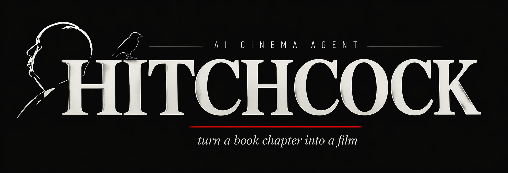
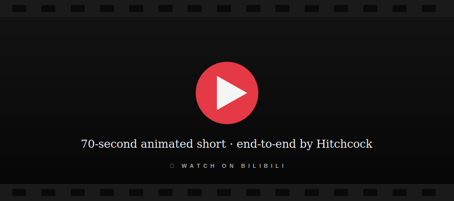

<div align="center">



**把一段文字——一章书、一段剧本——变成一部风格统一的 AI 动画短片。**

Hitchcock 是一条 **纯 CLI、为 AI agent 设计** 的多阶段流水线：起草剧本、拆分分镜、生成场景美术、渲染视频。


[](https://www.volcengine.com/product/seedance)
[](https://deepmind.google/technologies/gemini/)
[](#)

[English](./README.md) · **中文** · [CLI 契约 (AGENTS.md)](./AGENTS.md)

</div>

---

## 🎬 Demo

<div align="center">

[](https://www.bilibili.com/video/BV1A7oGBUEja/)

*一段 70 秒的尾声，由 Hitchcock 端到端生成——剧本 → 分镜 → 场景美术 → Seedance 2.0 视频 → ffmpeg 拼接。输入：一章约 1.8k 字的中文散文。*

</div>

---

## ⚡ 它做什么

你喂它一段文字——一章书、一段剧本、一场场景描写。Hitchcock 把它变成：

> 一部 **60–180 秒的动画短片**，风格统一，忠实于原作的逐场节奏，自带叙事性人声对白，全程不需要手改任何中间产物。

每一阶段都是 **门控式** 的：`generate` → `show` → `refine --feedback "..."` → `approve`。Python 代码只持有「元 prompt + schema + 管道」。所有故事相关的产物——场景标题、镜头语言、台词、场景美术 prompt、Seedance prompt——都由 MIMO 生成，唯一的编辑方式是自然语言反馈。

---

## 🤖 纯 CLI · 可被 agent 驱动

没有 GUI，没有网页控制台，没有手写 YAML。一个 `hitchcock` CLI 暴露所有阶段、所有 refine 旋钮、所有渲染路径，每个命令都支持 `--json`，另一个 AI 完全可以做导演：

- **每个动作只有一条 verb-noun 命令。** `hitchcock <stage> <generate|show|refine|approve>`——七个阶段，四个动词。一张表就能让 agent 背下整个契约。
- **机器可读的状态机。** `hitchcock status -s <story> --json` 返回各阶段状态 + `next_action` 字段。driver 读一下、执行、循环。
- **自然语言反馈是唯一的编辑入口。** `refine --feedback "合并 s03 和 s04，保留所有对白"`——不需要碰文件，不需要每次重写 prompt。
- **显式错误契约。** 任何非零退出都会打印 `hitchcock-error: <CODE>: <msg>`，可解析、可恢复。完整错误码见 [AGENTS.md §5](./AGENTS.md)。
- **端到端可脚本化。** 从一段源文到 `reel.mp4`，一条 bash for 循环搞定，或交给一个 sub-agent。

详见 **[AGENTS.md](./AGENTS.md)**——CLI 契约本身就是写给 AI driver 看的 spec。

---

## 🔄 Pipeline

| # | 阶段 | 输入 | 输出 |
|---|---|---|---|
| 0  | 🎯 **brief**       | 导演意图（一段自由文字）           | 结构化答案 + 通过 Gemini grounding 做背景研究 |
| 0b | 🎨 **style**       | brief                              | 美术指引（色板 / 光照 / 母题 / 禁忌）+ 风格锚点图 |
| 0c | 👥 **cast**        | 源文                                | 自动识别角色 + 地点，附 T2I 头像 |
| 1  | 📜 **script**      | 以上一切                            | 结构化 Story JSON（场景、节拍、对白、情绪基调） |
| 2  | 🎞 **storyboard**  | 已批准剧本                          | 逐场镜头拆分 + 可直接喂给 Seedance 的 prompt |
| 3  | 🖼 **art**         | 已批准分镜                          | Nano Banana Pro 生成首帧美术（每 shot N 张候选） |
| 4  | 🎥 **render**      | 已批准美术                          | Seedance 2.0 视频 → ffmpeg 拼接 → `reel.mp4` |

每道门锁住下一阶段。所有命令都支持 `--json` 输出。

---

## 🚀 Quickstart

```bash
cp .env.example .env        # 填入 API key
pip install -e .

# 一次性把可复用的角色 / 地点建入 bible
hitchcock design   path/to/character.txt
hitchcock location path/to/location.txt

# 门控式故事流水线
hitchcock init          -s my-arc --source path/to/source.txt
hitchcock brief answer  -s my-arc --intent "忠实原著、Arcane 画风、三分钟短片"
hitchcock brief research -s my-arc && hitchcock brief approve -s my-arc
hitchcock style  generate -s my-arc && hitchcock style  approve -s my-arc
hitchcock cast   discover -s my-arc && hitchcock cast   build   -s my-arc && hitchcock cast approve -s my-arc
hitchcock script generate -s my-arc && hitchcock script approve -s my-arc
hitchcock storyboard generate -s my-arc && hitchcock storyboard approve -s my-arc
hitchcock art    generate -s my-arc --candidates 2
hitchcock art    pick     -s my-arc --scene s01 --shot sh01 --candidate 2
hitchcock art    approve  -s my-arc

# 通过 Seedance 2.0（火山 Ark）渲染
hitchcock render seedance -s my-arc --scene s01,s02,s03,s04,s05
hitchcock render post     -s my-arc                        # → reel.mp4
```

**某一场想在进视频模型前先手调 prompt：**
```bash
hitchcock render package  -s my-arc
# 手编 render/packages/<scene>/prompt.txt
hitchcock render seedance -s my-arc --scene <csv> --use-package-prompt
```

**任何阶段都可以 refine，不用改代码：**
```bash
hitchcock script refine     -s my-arc --feedback "合并 s03 和 s04，保留全部对白"
hitchcock storyboard refine -s my-arc --scene s06 --feedback "两人都赤脚在同一块石头上，过肩镜头"
hitchcock art refine        -s my-arc --scene s12 --shot sh01 --feedback "仰角过肩构图，镜头朝天"
```

---

## 🏗 架构不变量

> **Python 代码只持有元 prompt + schema + 管道。**
> 任何故事相关的产物——标题、节拍、人声台词、镜头规格、场景美术 prompt、Seedance prompt——都由 MIMO 生成，唯一的编辑方式是 `refine --feedback "..."`。

完整 CLI 契约、磁盘数据模型、错误码、已知问题记录：见 **[AGENTS.md](./AGENTS.md)**。

---

## 🧰 模型栈

| 角色 | 模型 |
|---|---|
| LLM（所有 `refine` 调用）  | **Xiaomi MiMo**——OpenAI 兼容 |
| 背景研究                    | **Gemini 2.5 Flash** + Google Search grounding |
| T2I（主）                   | **Nano Banana Pro**（Gemini 2.5 Flash Image） |
| T2I（备选）                 | gpt-image-2 · 豆包 Seedream |
| 视频（主）                  | **Seedance 2.0**（火山 Ark） |
| 视频（人工后备）            | 即梦网页端打包 |
| 存储                        | 文件系统（`bible/<characters\|locations\|stories>/...`） |

---

## 📁 仓库结构

```
src/hitchcock/
├── cli.py                # CLI 入口——`hitchcock ...`
├── config.py             # 配置 / 环境变量加载
├── agents/               # 每个 pipeline 阶段一个文件
│   ├── brief.py  style.py  cast.py
│   ├── script.py  storyboard.py
│   ├── scene_art.py  shot_gen.py
│   └── design.py  location.py  post.py  tts.py
├── bible/                # 故事 bible 存储 + Pydantic schema
├── llm/                  # MiMo + Gemini 客户端
├── image/                # Nano Banana · gpt-image-2 · Ark Seedream 客户端
└── video/                # Seedance 2.0 客户端
scripts/
└── runway_seedance_runner.py   # 通过 Runway Seedance 2 做 A/B 的一次性脚本
```

---

## 🙏 致谢

- **Arcane** / Fortiche Studio——主要画风参考
- 感谢 **MiMo**、**Gemini**、**Seedance**、**Nano Banana Pro**、**即梦** 各团队
